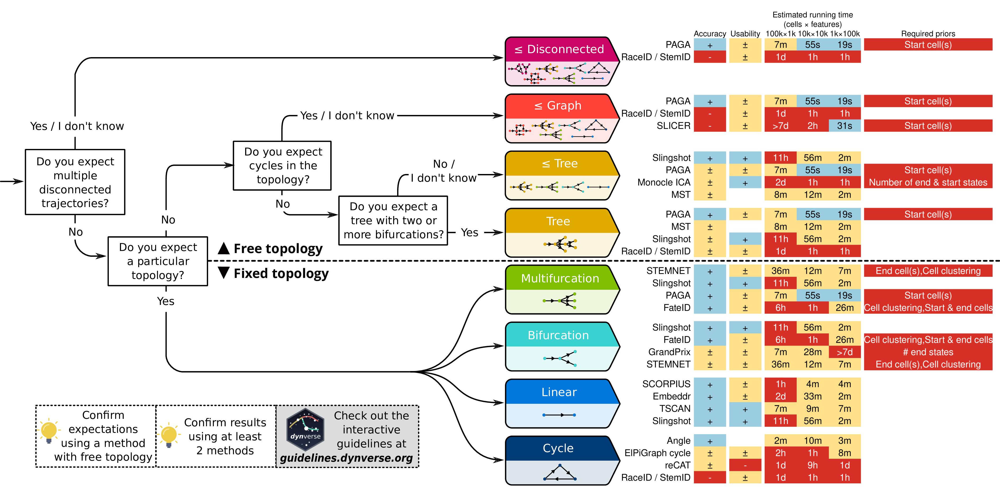

# Guidelines for method users

Based on the results of our benchmark, we propose a set of practical
guidelines for method users ([**Figure 1**](#fig_user_guidelines) and
[guidelines.dynverse.org](http://guidelines.dynverse.org)). We postulate
that, as a method’s performance is heavily dependent on the trajectory
type being studied, the choice of method should currently be primarily
driven by the anticipated trajectory topology in the data. For the
majority of use cases, the user will know very little about the expected
trajectory, except perhaps whether the data is expected to contain
multiple disconnected trajectories, cycles or a complex tree structure.
In each of these use cases, our evaluation suggests a different set of
optimal methods, as shown in [**Figure 1**](#fig_user_guidelines).
Several other factors will also impact the choice of methods, such as
the dimensions of the dataset, and the prior information which is
available. These factors and several others can all be dynamically
explored in our interactive app
([guidelines.dynverse.org](https://guidelines.dynverse.org)). This app
can also be used to query the results of this evaluation, such as
filtering the datasets, or changing the importance of the evaluation
metrics for the final ranking.

 

<strong>[**Figure 1**](#fig_user_guidelines): Practical guidelines for
method users.</strong> As the performance of a method mostly depends on
the topology of the trajectory, the choice of TI method will be
primarily influenced by the user’s existing knowledge about the expected
topology in the data. We therefore devised a set of practical
guidelines, which combines the method’s performance, user friendliness
and the number of assumptions a user is willing to make about the
topology of the trajectory. Methods to the right are ranked according to
their performance on a particular (set of) trajectory type. Further to
the right are shown the accuracy (+: scaled performance ≥ 0.9, ±: \>
0.6), usability scores (+: ≥ 0.9, ± ≥ 0.6), estimated running times and
required prior information.

-----
