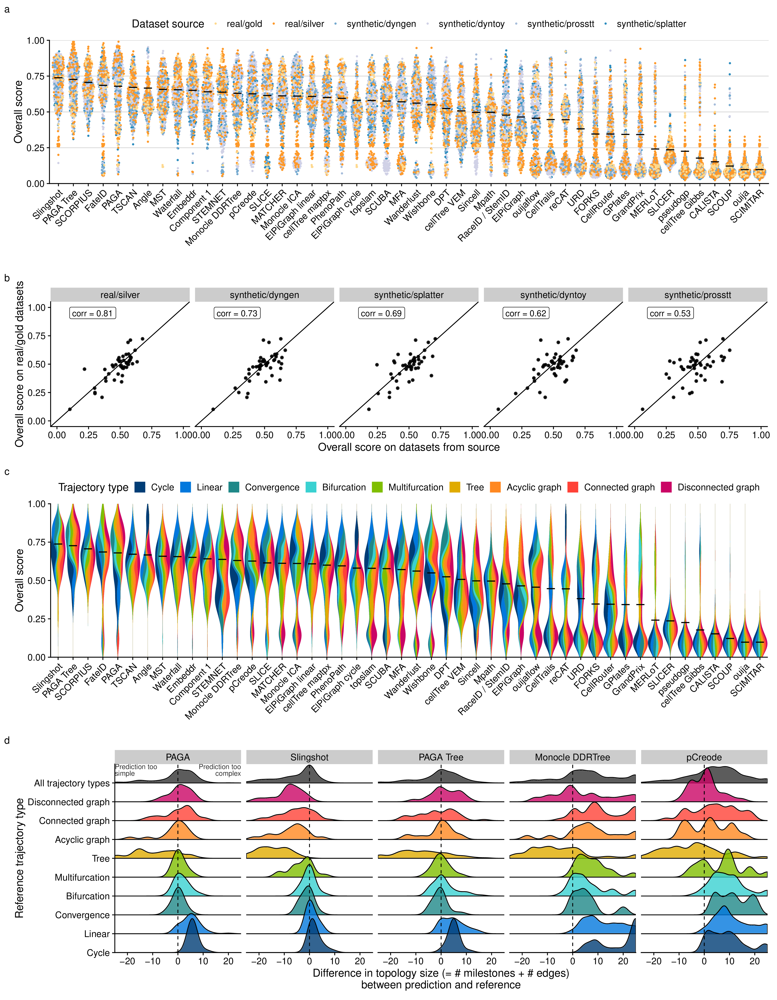

# Benchmark interpretation

<strong>[**Figure 1**](#fig_benchmark_interpretation): Accuracy of
trajectory inference methods.</strong> (a) Overall score for all methods
and datasets, colored by the source of the datasets. (c) Similarity
between the overall scores of all dataset sources, compared to real
datasets with a gold standard. (b) Bias in the overall score towards
trajectory types. (d) Distributions of the difference in size between
predicted and reference topologies. A positive difference means that the
topology predicted by the method is more complex than the one in the
reference.

-----
