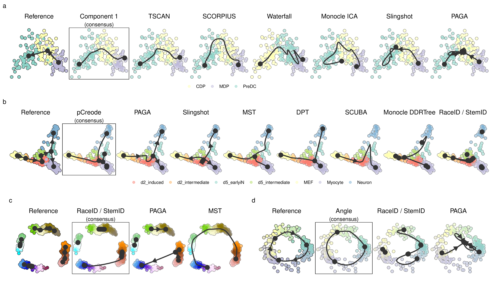

# Examples trajectories

Some examples of inferred trajectories on the same dataset for different
methods ([**Figure 1**](#fig_example_predictions)).

<strong>[**Figure 1**](#fig_example_predictions): Demonstration of how a
common framework for TI methods facilitates broad applicability using
some example datasets.</strong> Trajectories inferred by each method
were projected to a common dimensionality reduction using
multi-dimensional scaling. For each dataset, we also calculated a
“consensus” prediction, by calculating the cordist between
each pair of models, and picking the model with the highest score on
average. (a) The top methods applied on a dataset containing a linear
trajectory of differentiation dendritic cells, going from MDP, CDP to
PreDC. (b) The top methods applied on a dataset containing a bifurcating
trajectory of reprogrammed fibroblasts. (c) A synthetic dataset
generated by dyntoy, containing four disconnected trajectories. (d) A
synthetic dataset generated by dyngen, containing a cyclic trajectory.

-----
